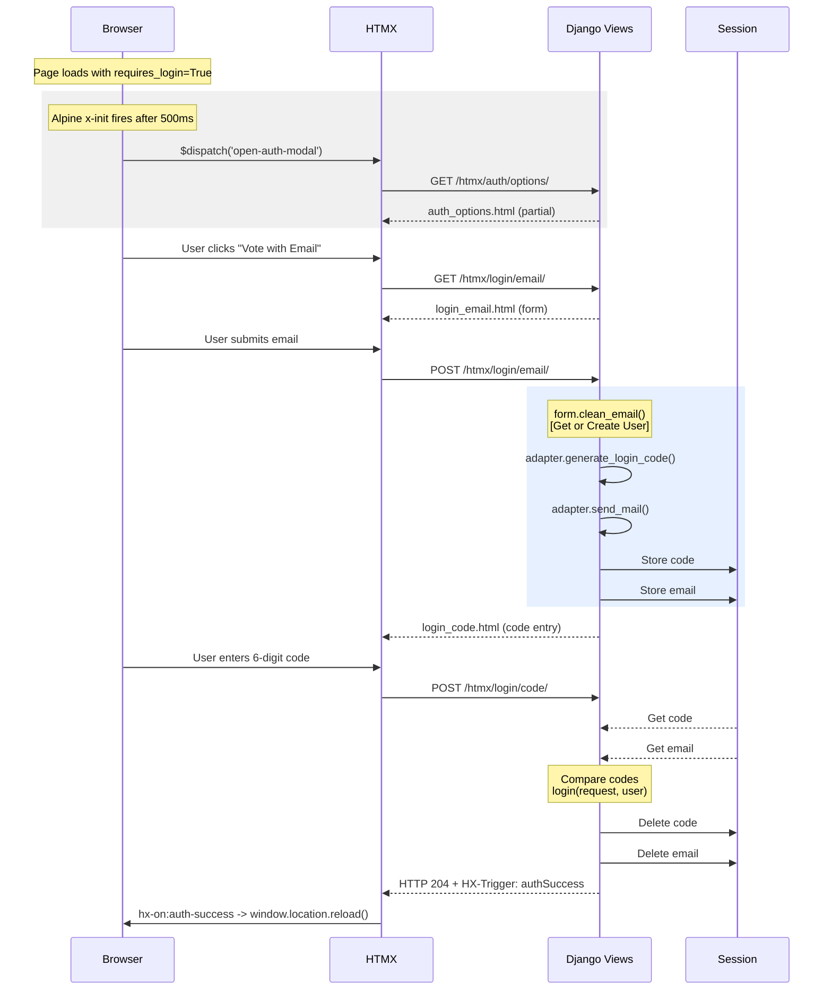
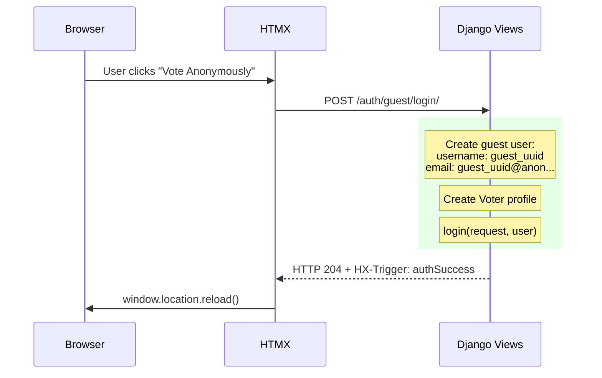

# Modal Authentication System

This document describes the HTMX-powered modal authentication flow used in Cosounds for voter authentication.

## Overview

The system provides a seamless, in-page authentication experience using:
- **HTMX** for partial page updates without full reloads
- **Alpine.js** for modal state management and animations
- **Django Sessions** for temporary code storage
- **django-allauth** adapter for email delivery

## Architecture

```mermaid
graph TD
    subgraph Frontend [FRONTEND Browser]
        direction TB
        Base[base.html Global Modal]
        AuthModal[#auth-modal Alpine.js x-data]
        AuthContent[#auth-modal-content HTMX swap target]
        
        Body[body hx-on:auth-success="window.location.reload"]
        
        Voting[voting/content.html]
        
        Base --> AuthModal
        AuthModal --> AuthContent
        Body -.-> Base
        
        Voting -- "if requires_login -> x-init" --> Dispatch["$dispatch('open-auth-modal')"]
        Dispatch --> HTMXRequest["htmx.ajax('GET', '/auth/htmx/auth/options/')"]
    end

    subgraph Backend [BACKEND Django]
        direction TB
        
        subgraph URLs [urls.py users app]
            UrlOpt["/auth/htmx/auth/options/"]
            UrlEmail["/auth/htmx/login/email/"]
            UrlCode["/auth/htmx/login/code/"]
            UrlGuest["/auth/guest/login/"]
        end
        
        subgraph Views [views.py]
            ViewOpt[htmx_auth_options]
            ViewEmail[htmx_login_email]
            ViewCode[htmx_login_code]
            ViewGuest[guest_login_view]
        end
        
        subgraph Adapters [adapters.py]
            Adapter[UnifiedLoginAdapter]
            GenCode[generate_login_code]
            Form[UnifiedRequestLoginCodeForm]
            CleanEmail["clean_email() auto-signup"]
            
            Adapter --> GenCode
            Form --> CleanEmail
        end
        
        subgraph Session [Session Storage]
            SessCode["request.session['login_code']"]
            SessEmail["request.session['login_email']"]
        end
        
        UrlOpt --> ViewOpt
        UrlEmail --> ViewEmail
        UrlCode --> ViewCode
        UrlGuest --> ViewGuest
        
        ViewEmail --> Form
        ViewEmail --> Adapter
        ViewEmail -.-> Session
        
        ViewCode -.-> Session
    end
    
    HTMXRequest --> UrlOpt
```

## Sequence Diagrams

### Email Login Flow



### Anonymous/Guest Login Flow



## File Structure

```
src/server/src/
├── users/
│   ├── urls.py                    # Route definitions
│   ├── views.py                   # HTMX view functions
│   ├── adapters.py                # Form & adapter classes
│   └── templates/
│       └── account/
│           └── partials/
│               ├── auth_options.html   # Initial choice screen
│               ├── login_email.html    # Email input form
│               └── login_code.html     # Code verification form
│
└── app/
    └── templates/
        └── voter/
            ├── base.html          # Contains global #auth-modal
            └── voting/
                └── content.html   # Triggers modal when requires_login
```

## Component Details

### 1. Global Modal (`base.html`)

The modal is defined once in `base.html` and available on all pages:

```html
<body hx-on:auth-success="window.location.reload()">
    <!-- ... page content ... -->
    
    <div id="auth-modal"
         x-data="{ open: false }"
         @open-auth-modal.window="open = true; $el.classList.remove('invisible');"
         @close-auth-modal.window="open = false; ...">
        
        <div id="auth-modal-content">
            <!-- HTMX swaps content here -->
        </div>
        
        <div id="auth-modal-loader" class="htmx-indicator">
            <!-- Loading spinner shown during requests -->
        </div>
    </div>
</body>
```

**Key Features:**
- `x-data="{ open: false }"` - Alpine.js state for visibility
- `@open-auth-modal.window` - Listens for custom event to open
- `hx-on:auth-success` - HTMX event listener that reloads page on success
- `htmx-indicator` - Auto-shown/hidden during HTMX requests

### 2. Modal Trigger (`voting/content.html`)

When a page requires authentication:

```html

<div x-data
     x-init="
        setTimeout(() => {
            $dispatch('open-auth-modal');
            htmx.ajax('GET', '', {target: '#auth-modal-content'});
        }, 500)
     ">
    <!-- Blurred background content -->
</div>

```

**How it works:**
1. Alpine's `x-init` runs after DOM ready
2. 500ms delay for smooth UX
3. `$dispatch('open-auth-modal')` triggers the modal to open
4. `htmx.ajax()` loads the auth options into `#auth-modal-content`

### 3. Views (`views.py`)

#### `htmx_auth_options(request)`
Simply renders the initial choice screen.

```python
def htmx_auth_options(request):
    return render(request, "account/partials/auth_options.html")
```

#### `htmx_login_email(request)`
Handles email submission with auto-signup:

```python
def htmx_login_email(request):
    form = UnifiedRequestLoginCodeForm(request.POST or None)
    
    if request.method == "POST" and form.is_valid():
        email = form.cleaned_data["email"]
        adapter = get_adapter(request)
        
        # Generate & Send Code
        code = adapter.generate_login_code()
        adapter.send_mail("account/email/login_code", email, {"code": code})
        
        # Store in session
        request.session["login_code"] = code
        request.session["login_email"] = email
        
        return render(request, "account/partials/login_code.html", {"email": email})
    
    return render(request, "account/partials/login_email.html", {"form": form})
```

#### `htmx_login_code(request)`
Verifies the code and logs in:

```python
def htmx_login_code(request):
    email = request.session.get("login_email")
    correct_code = request.session.get("login_code")
    
    if not email or not correct_code:
        return render(request, "account/partials/auth_options.html")  # Reset
    
    if request.method == "POST":
        input_code = request.POST.get("code", "").strip()
        
        if input_code == correct_code:
            user = User.objects.get(email__iexact=email)
            login(request, user, backend="django.contrib.auth.backends.ModelBackend")
            
            # Cleanup session
            del request.session["login_code"]
            del request.session["login_email"]
            
            # Trigger page reload via HTMX
            return HttpResponse(status=204, headers={"HX-Trigger": "authSuccess"})
```

#### `guest_login_view(request)`
Creates anonymous user and logs in immediately:

```python
@require_POST
def guest_login_view(request):
    unique_id = uuid.uuid4().hex[:12]

    user = User.objects.create_user(
        username=f"guest_{unique_id}",
        email=f"guest_{unique_id}@anon.cosound.io",
        password=None,
    )
    
    # Create voter profile
    Voter.objects.create(user=user, nvec=NaturalVector.null())
    
    login(request, user, backend="django.contrib.auth.backends.ModelBackend")
    
    if request.headers.get("HX-Request"):
        return HttpResponse(status=204, headers={"HX-Trigger": "authSuccess"})
```

### 4. Form & Adapter (`adapters.py`)

#### `UnifiedLoginAdapter`
Extends django-allauth's adapter for code generation:

```python
class UnifiedLoginAdapter(DefaultAccountAdapter):
    def generate_login_code(self):
        return "".join(random.choices("0123456789", k=6))
```

#### `UnifiedRequestLoginCodeForm`
Handles email validation with auto-signup:

```python
class UnifiedRequestLoginCodeForm(forms.Form):
    email = forms.EmailField()

    def clean_email(self):
        email = self.cleaned_data.get("email", "").lower().strip()
        User = get_user_model()

        # Get or Create User (case-insensitive)
        try:
            user = User.objects.get(email__iexact=email)
        except User.DoesNotExist:
            user = User.objects.create(
                email=email,
                username=f"{email.split('@')[0]}_{uuid.uuid4().hex[:8]}",
            )
            user.set_unusable_password()
            user.save()

        # Ensure Voter Profile exists
        if not hasattr(user, "voter"):
            Voter.objects.create(user=user, nvec=NaturalVector.null())
        
        return email
```

## Integration with django-allauth

This system **partially integrates** with django-allauth:

| Component | Source | Notes |
|-----------|--------|-------|
| `DefaultAccountAdapter` | allauth | Base class for our adapter |
| `get_adapter(request)` | allauth | Gets configured adapter instance |
| `send_mail()` | allauth | Uses allauth's email templates |
| Email templates | allauth | `account/email/login_code.txt` |
| Code generation | Custom | `generate_login_code()` in our adapter |
| Session storage | Custom | Direct session keys, not allauth's stage system |
| Code verification | Custom | Manual comparison, not allauth's forms |

**Why not use allauth's full flow?**

Allauth's `LoginCodeVerificationProcess` uses a complex "stage" system tied to its multi-step login flow. For our HTMX modal approach, we needed:
- Simple session storage (just code + email)
- Direct control over HTTP responses (204 + HX-Trigger)
- No page redirects between steps

## HTMX Response Patterns

### Partial HTML Response
Most responses return HTML fragments that HTMX swaps into `#auth-modal-content`:

```python
return render(request, "account/partials/login_code.html", {"email": email})
```

### Success Response (No Content + Trigger)
On successful auth, we return 204 with a custom trigger:

```python
return HttpResponse(status=204, headers={"HX-Trigger": "authSuccess"})
```

The `<body>` element listens for this:
```html
<body hx-on:auth-success="window.location.reload()">
```

### Error Handling
Errors are passed as context and displayed in the partial:

```python
return render(request, "account/partials/login_code.html", {
    "email": email, 
    "error": "Invalid code.",
    "value": request.POST.get("code", "")  # Preserve input
})
```

## Session Management

| Key | Value | Lifetime |
|-----|-------|----------|
| `login_code` | 6-digit string | Until verified or session expires |
| `login_email` | User's email | Until verified or session expires |

**Important:** We do NOT use `set_expiry()` for these keys because it affects the entire session duration, which would log users out after 5 minutes even after successful authentication.

## Security Considerations

1. **Code Expiry**: Relies on Django's default session expiry (configurable via `SESSION_COOKIE_AGE`)
2. **Brute Force**: No built-in rate limiting on code attempts (consider adding)
3. **CSRF**: Protected via `hx-headers='{"x-csrftoken": "{{ csrf_token }}"}'` on body
4. **Guest Accounts**: Identifiable by `@anon.cosound.io` domain for cleanup

## Testing the Flow

1. Navigate to a voting page while logged out
2. Modal should appear after 500ms
3. Choose "Vote with Email" or "Vote Anonymously"
4. For email: Enter email → Check console for code (dev) → Enter code
5. Page should reload with authenticated session